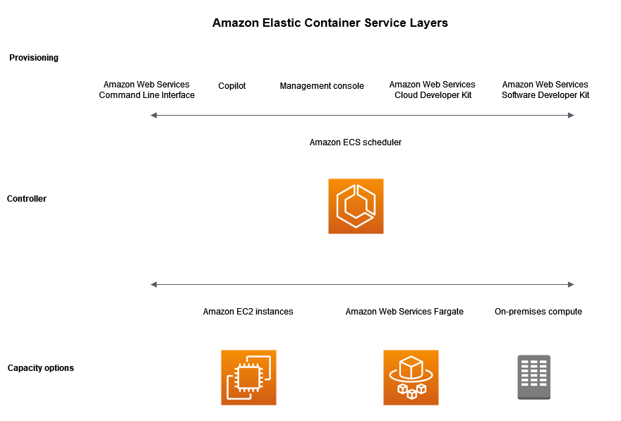
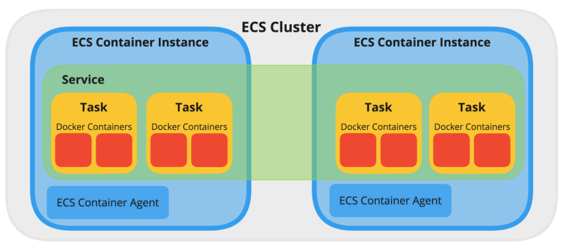

# ECS

`Amazon ECS(Elastic Container Service)`란 클러스터에서 컨테이너를 쉽게 실행, 중지, 관리할 수 있게 해주는 컨테이너 관리 서비스  

`ECS`의 경우 클러스터를 관리하기 위한 별도의 인스턴스를 구성 및 관리하지 않아도 되며, 다른 AWS 서비스와 연동 지원도 되는 장점이 있음  

`Docker Swarm`, `Kubernetes`, `Nomad` 등 다른 컨테이너 오케스트레이션 서비스들에 비해 부족한 기능들도 있지만, 비용적인 부분이나 적은 러닝커브로 빠른 적용이 가능함  

## AWS ECS Layer

- Capacity Options: 컨테이너가 실행되는 인프라
- Controller: 컨테이너에서 실행되는 애플리케이션 배포 및 관리
- Provisioning: 스케줄러와 인터페이스하여 애플리케이션과 컨테이너를 배포하고 관리하는 도구

## AWS ECS Components

ECS의 주요 구성요소는 아래와 같음  

### Task Definition

원하는 docker 컨테이너를 생성할 때 어떤 설정으로 몇 개 이상 생성할지를 정의한 set  

기존 docker run 명령에서 가능했던 대부분 옵션이 설정가능함  

매번 설정들을 지정하기보다, 설정들의 집합을 하나의 단위로 정의해놓고 사용하는 것  

### Task

container를 실행하는 최소 단위이며 최소 1개 이상의 container로 구성  

Task 내의 컨테이너는 모두 같은 ECS cluster instance 내에서 실행됨  

약간 docker-compose와 비슷한 개념  

### Service

task definition을 이용하여 task실행 유형, 타입, 테스크가 실행되어야할 작업 개수, 배포방식, 배치전략 등을 설정하여 Task를 실행 및 관리하도록 도와줌(Life Cycle 관리)  

task를 관리하는 상위 그룹 개념  

### Container Instance

task가 배포되는 EC2 instance

(여기서 EC2는Amazon Elastic Compute Cloud를 의미하며,   

EC2 instance는 가상화된 컴퓨터 리소스를 제공하는 가상머신을 뜻함)  

### Cluster

task가 배포되는 container instance들을 논리적 그룹으로 묶은 것  

## Reference

- https://docs.aws.amazon.com/ko_kr/AmazonECS/latest/developerguide/Welcome.html
- https://docs.aws.amazon.com/ko_kr/ecs/index.html
- https://boostbrothers.github.io/technology/2020/01/29/AWS-ECS-%EC%82%B4%ED%8E%B4%EB%B3%B4%EA%B8%B0/
- https://brunch.co.kr/@topasvga/1629
