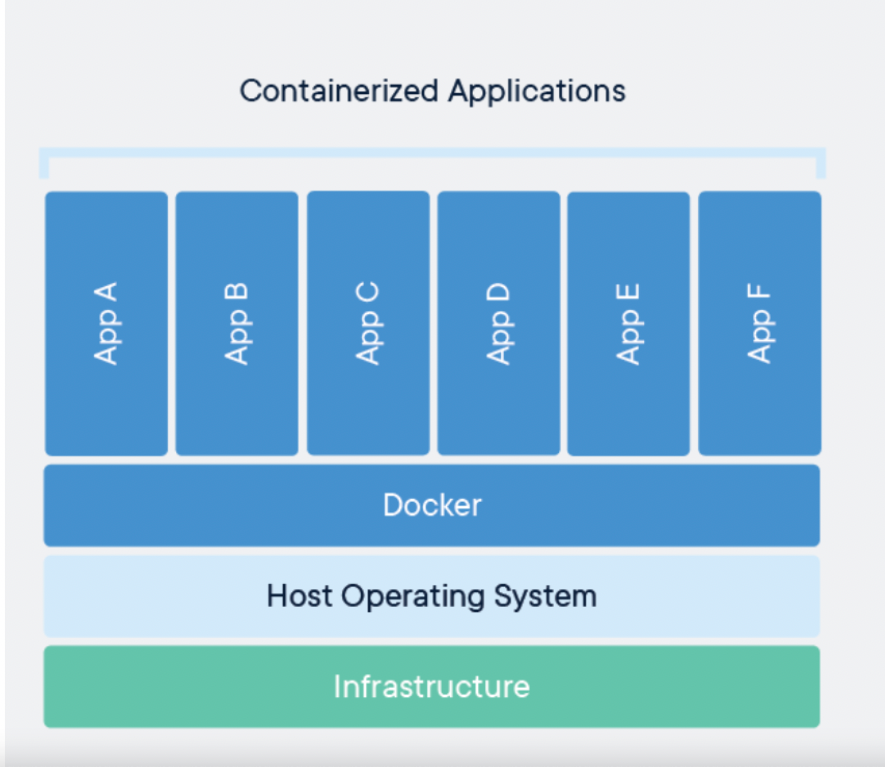
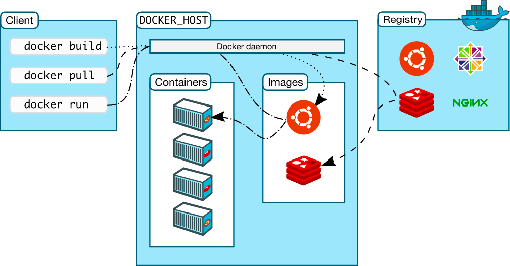

# Docker는 뭐야?
[AWS](https://aws.amazon.com/) 의 정의를 빌리자면 Docker는 어플리케이션을 신속하게 구축, 테스트, 배포할 수 있는 소프트웨어 플랫폼이다.

Docker는 컨테이너라는 개념을 사용하여 기존의 무거운 운영체제, 가상머신 등에서 돌아가는 어플리케이션을 경량화하여, 여러 문제점을 해결하고 있다.

최근에는 Docker가 로컬뿐 아니라, 다양한 클라우드 환경에서도 활용되고 있다.

일례로 AWS에서도 Docker 이미지를 활용하여 배포할 수 있으며, Github Actions에서도 Docker를 설치하여 배포 자동화, 간단한 배포와 같은 작업을 수행하도록 할 수 있다.

## Docker는 무슨 문제를 해결하는가?
개발환경을 설치하면서 본인의 개발환경을 설치하다보면 여러 문제를 마주친다.

필자는 이전 프로젝트를 진행하면서 한 팀원이 `Python`에서 `Maria DB`를 사용하기 위해 `mysqlclient`라는 모듈을 설치하는 과정에서 오류가 생겨 Trouble Shooting하는 과정에서 Python이라는 언어가 버전에 굉장히 민감하다는 것을 알았다.

프로젝트 시작 당시는 Python 3.8버전이 나왔을 때였고, 친구가 오류가 난 시점은 Python 3.10을 사용하고 있었다.

알고보니 `mysqlclient`모듈을 Python 3.9 까지만 나와있었고, 친구의 Python은 3.10 버전이었다.

이런 문제는 비단 Python이라는 특수한 언어환경에서만 일어나는 것이 아니다.

특히 OS가 다를 경우, OS의 버전이 다를 경우 이런 상황들이 빈번하게 일어날 수 있는데, 예를 들어 이런 일이 있을 수 있다.

1. 윈도우 개발자는 VS의 C를 사용한다.
2. 리눅스 개발자는 gcc 컴파일러를 사용한다.


```cpp
#include<stdio.h>
#include<stdlib.h>

int add(int num,...)
{
    int a, b, anw=0;
    int* point=NULL;

    point=&num+1;

    for(a=0;a<=num;a++)
    {
        anw+=point[a];
    }
    return anw;
}
```
VS에서 위 함수는 단순히 첫 인자 num을 활용하여 뒤에 붙는 파라미터를 가변인자처럼 사용하여 파라미터를 다 더하는 함수이나,

GCC에서는 해당 표기방식을 지원하지 않아 쓰레기값이 반환된다.

이처럼 사용하는 개발환경, 컴파일러, 버전을 일치시키기 위해 개발자들은 컨벤션과 환경설정 파일을 통해 관리할 수 있으나, 이도 좋은 방식이라고 할 수 없다.

1. 신버전에 좋은 기능이나 보안패치 등이 있어 업데이트를 해야하는 상황에서 업데이트 할 수 없도록 막을 수 있다.
> 이 경우 모든 개발자들이 버전을 맞추기 위해 모듈을 업데이트 해야한다. 여간 귀찮은 일이 아닐 수 없다.
2. 새롭게 신규 개발자가 투입되었을 경우 해당 버전에 대한 오류, 개발 환경 세팅을 하나부터 열까지 계속 수행햐야 한다. 
> 개발자들 인건비도 비싼데, 인력 낭비다.

# 가상머신 (Virtual Machine)
그렇다면 이를 쉽게 할 수는 없을까? 

처음 이를 위한 대안으로 제시된 것은 **가상머신**이다.

운영체제를 가상화해서 CPU 에서 독립적으로 동작하게 하는 것이라고 간단하게 이해하고 넘어가면 된다.
가상머신을 사용하면, 개발환경, 특정 모듈, 버전 등이 이미 설치된 운영체제를 이미지 형태로 만들어 관리할 수 있다.

만능 해결책처럼 보이나, 가상머신에도 **문제**가 있다.

_**자원 낭비라는 점이다.**_

많은 운영체제들은 내가 개발할 도구, 환경 뿐 아니라 각자의 독립적인 프로그램을 함께 포함하고 있다.
일종의 하나의 컴퓨터를 내 컴퓨터 안에서 실행시킨다고 보아도 무방할 것이다.

`HyperVisor`라는 것이 있다. HyperVisor은 컴퓨터가 가지고 있는 인프라 리소스를 가상머신 별로 배분하는 역할을 한다.
인프라 리소스를 배분받은 각 가상머신은 독립적인 Guest OS를 가지고 있다. 


위 사진을 보면 각 VM당 할당된 OS가 눈에 띈다. 이는 앞서 언급한 불필요한 리소스를 가중시키므로, 자원 낭비라고 언급하였다.

# 컨테이너
그럼 컨테이너는 어떨까?
컨테이너는 본인 OS 즉 HOST 위에서 마치 각각의 **독립적인 프로그램처럼 실행**되고 관리된다.

각 컨테이너는 Docker 엔진 하에서 각각 독립적으로 실행되기에 OS를 만드는 작업 및 인프라를 독립적으로 나눌 필요가 없고, 확장성이 좋고 빠르다.



또한 마이그레이션, 백업, 전송이 쉽다. VM에 비해 크기가 작기 때문이다.

**"이제 신입 개발자는 여러 가상머신을 설치하여 컴퓨터가 느려질 걱정을 할 필요가 없게 되었다."** 

_~~컨테이너를 관리하면 되니까~~_


# Docker
이제 다시 본론이다. 그럼 도커는 뭘까? 

Docker는 앞서 설명한 컨테이너 기반의 오픈소스 가상화 오픈소스 플랫폼 중 하나이다.
이는 OS 뿐 아니라, DB, Compiler, interpreter 등 개발에 필요한 다양한 인프라가 이미 Docker에서 이미지의 형태로 제공된다.
> _해당 인프라가 얼마나 대단한지는 [Docker Hub](https://hub.docker.com/) 를 잠시 둘러보라_



#### Image
Docker의 컨테이너는 각 어플리케이션을 패키징 하고, 실행할 수 있는 기능을 제공한다.
> 이것이 도커의 강력한 이미지(`image`)이다. 이미지는 컨테이너를 패키징한 결과물이다.

#### Volume, Bind
Host의 저장소를 직접 `bind`하여 사용할 수도 있고, Docker의 가상화된 저장 공간 안에(사실은 호스트의 저장공간에) `volume`을 만들어 다른 컨테이너와 공유하도록 사용할 수도 있다.

이와 같은 강력한 특징이 무엇을 서사하냐면, 나의 개발 저장소(Git, SVN)등을 가상화된 OS 안으로 직접 밀어넣지 않고도, 느슨한 Linking을 통해 개발사항을 실시간으로 반영할 수 있음을 의미한다.

#### Docker Registry
앞서 Docker Hub를 통해 빌드된 이미지를 내려받아 사용할 수 있음을 피력했다. Docker Registry는 이미지를 저장하는 공간이며, Docker Hub는 Docker를 사용하는 사용자의 공용 레지스트리이다.

# Reference
- [https://velog.io/@geunwoobaek/%EC%BB%A8%ED%85%8C%EC%9D%B4%EB%84%88-%EB%B0%8F-%EB%8F%84%EC%BB%A4-%EA%B0%9C%EB%85%90%EC%A0%95%EB%A6%AC](https://velog.io/@geunwoobaek/%EC%BB%A8%ED%85%8C%EC%9D%B4%EB%84%88-%EB%B0%8F-%EB%8F%84%EC%BB%A4-%EA%B0%9C%EB%85%90%EC%A0%95%EB%A6%AC)
- [https://docs.docker.com/get-started/overview/](https://docs.docker.com/get-started/overview/)
- [https://subicura.com/2017/01/19/docker-guide-for-beginners-1.html](https://subicura.com/2017/01/19/docker-guide-for-beginners-1.html)
- [https://www.baeldung.com/ops/docker-container-states](https://www.baeldung.com/ops/docker-container-states)
