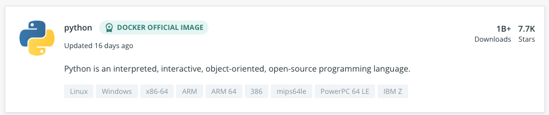
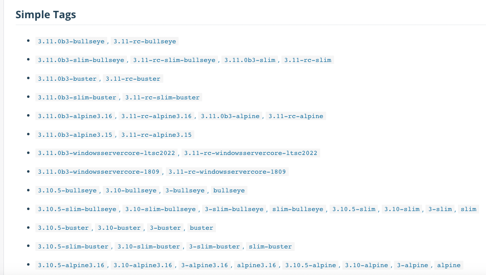

# Docker 시작
이제 도커의 개념을 하나하나 확인해보면서 Docker를 시작해보도록 하자

## Docker 설치
[링크](https://docs.docker.com/get-docker/) 를 따라 들어가 자신의 운영체제에 맞는 Docker를 설치하자

## Docker 이미지 가져오기
Docker를 실행하기 위해서 [Docker Hub](https://hub.docker.com)에서 제공하는 많은 이미지를 사용해볼 수 있다.
시험삼아 Python 이미지를 가져오도록 하자


> ▲ Docker Hub에서 `python`을 검색한 모습

터미널을 열고 `docker pull python`을 입력하면 최신의 파이썬 이미지를 받을 수 있다.


> 만약 자신의 서비스가 특정 버전의 파이썬을 요구할 경우 태그를 찾아 특정 버전의 파이썬을 설치할 수도 있다.
_예) `docker pull python:3.8.13`_ 


## Docker Container Status
하기 명령어를 알기 위해서는 Docker 컨테이너의 상태를 이해할 필요가 있다.

Docker 컨테이너는 일반적인 프로세스와 마찬가지로 여러가지 상태 값을 가진다.

각 상태 값에 대한 설명은 아래와 같다.
#### 1. Created
컨테이너가 생성된 후 한 번도 사용되지 않았을 경우, 해당 상태가 할당된다.

Host OS의 CPU나 메모리를 소비하지 않는다.

#### 2. Running
말 그대로 컨테이너를 실행 중인 상태를 뜻한다.
해당 상태는 컨테이너 속 프로세스가 환경(Host OS)와는 독립적으로 실행 중임을 의미한다.

#### 3. Restarting
이 상태 역시, 말 그대로 컨테이너가 재시작 중임을 뜻한다.

`docker run` 명령어에서 옵션 `--restart=[RESTART_POLICY]`를 통해 재시작 시 액션을 정의할 수 있다.
* `RESTART_POLICY`
  * `no`: 재시작 안함(`default`)
  * `on-failure`: 컨테이너가 정상종료(0번 코드로 종료)가 아닐 시 재시작
  * `always`: 프로세스 종료 시 항상 재시작
  * `unless-stopped`: 명시적으로 중지되거나, Docker 자체가 중지, 또는 재시작 되지 않는 이상 컨테이너를 재시작함.

#### 4. Exited
내부 프로세스가 종료되었을 때 해당 상태로 변경된다. Created 상태와 마찬가지로 CPU, 메모리를 소비하지 않는다.

> 일반적으로 컨테이너가 Exited 상태가 되는 이유는 다음과 같다.
1. 내부 프로세스가 완료됨.
2. 내부 프로세스가 실행 중에 예외가 발생함.
3. `docker`의 `stop` 명령어를 통해 의도적으로 종료됨.
4. `bash`를 실행하는 컨테이너에 대화형 터미널이 설정되지 않음.

#### 5. Paused
무기한동안 모든 프로세스가 일시 중단된 상태를 나타낸다.
`docker pause` 명령어를 통해 Docker의 특정 컨테이너를 일시중지 할 수 있다.

#### 6. Dead
해당 상태는 컨테이너를 지우려고 시도하였으나, 특정 자원이 외부 프로세스에서 이용 중일 경우 나타나는 상태이다.

해당 상태의 컨테이너는 재시작할 수 없으며, 오직 지우는 액션만 가능하다.

## 컨테이너의 생성: `create`
받은 이미지를 기반으로 `create` 명령어를 이용해 컨테이너를 `생성`할 수 있다.

### Usage
사용 방식은 다음과 같다.
```
docker create [OPTIONS] IMAGE [COMMAND] [ARG...]
```

### 자주 사용되는 옵션
#### `--name [CONTAINER_NAME]`
#### `--publish, -p [HOST_PORT]:[CONTAINER_PORT]`
#### `--tty, -t`
#### `--volume, -v [VOLUME_NAME]:[REMOTE_PATH]`
#### `--workdir, -w [WORKDIR_PATH]`

## 컨테이너의 생성과 실행: `run`
받은 이미지는 `run` 명령어를 통해 실행시킬 수 있다.
> 정확히 `run` 명령어는 컨테이너를 생성(`create`)하고, 해당 컨테이너를 실행(`exec`)시킨다.

### Usage
사용 방식은 다음과 같다.
```
docker run [OPTIONS] IMAGE [COMMAND] [ARG...]
```

### 자주 사용되는 옵션
Docker의 `run` 명령어의 모든 옵션을 보고 싶다면 [이 페이지](https://docs.docker.com/engine/reference/commandline/run/) 를 참고하자

해당 섹터에서는 자주 사용되는 옵션과 왜 자주 사용되는지를 설명한다. 

#### `--name [CONTAINER_NAME]`
실행될 컨테이너의 이름을 지을 때 사용한다.
```
$ docker ps -a

CONTAINER ID   IMAGE                    COMMAND                  CREATED              STATUS                  PORTS                    NAMES
d4a0d00c26f9   docker/getting-started   "/docker-entrypoint.…"   21 seconds ago       Created                                          hello
000e821c8396   docker/getting-started   "/docker-entrypoint.…"   About a minute ago   Up About a minute       0.0.0.0:80->80/tcp       admiring_jemison
```
docker로 생성된 모든 컨테이너를 보려면 `docker ps -a`를 입력하면 된다.
컨테이너의 이름은 가장 우측 컬럼에 표시되며, name을 hello로 지정한 컨테이너는 컨테이너의 이름을 갖고 있다.

이름이 설정된 컨테이너의 경우 추후 빌드할 때 이미지 명이 컨테이너명으로 설정된다.

#### `--detach, -d`
해당 옵션이 설정된 컨테이너는 Host OS에서 백그라운드 프로세스로 실행되며, 실행되고 있는 컨테이너 ID를 반환한다.

#### `--interactive, -i`
컨테이너와 연결(`attach`)되어 있지 않더라도 표준 입력(`STDIN`)을 활성화합니다.

#### `--tty, -t [SHELL_NAME]`
TTY 모드를 활성화한다. SSH 연결이 성공하면 저절로 디폴트로 설정된 터미널이 실행되는 것처럼, 해당 옵션을 설정하면 터미널이 열린 채로 컨테이너를 실행시킬 수 있다.

터미널은 기본적으로 키보드 입력이 필요하므로, 일반적으로 상기 `-i` 옵션과 함께 사용된다.

#### `--volume, -v`
`docker volume`을 `container`의 경로에 `bind`한다.

> 지금은 그냥 _'저장소를 연결하는구나~'_ 라고 생각하자. 
> 
> 이는 Docker Volume에 대한 이해가 필요하기 때문이며, 비슷한 개념을 추후 비교 학습을 통해 알아볼 것이기 떄문이다.

#### `--publish, -p [HOST_PORT]:[CONTAINER_PORT]`
호스트의 포트와 컨테이너의 포트를 지정한다.

#### `--workdir, -w`
컨테이너 속 프로세스가 실행될 디렉토리를 지정한다.
설정된 Working Directory는 초기 진입점이 된다.

#### `--env, -e [KEY=VALUE]`
컨테이너에 환경 변수를 지정합니다. 보통 설정 값이나 비밀번호 등을 컨테이너로 전달할 때 사용됩니다.

#### 옵션의 조합
하이푼(`-`)을 하나만 사용하는 옵션의 경우 여러개의 옵션을 혼합하여 사용할 수 있다.
```
// Example
$ docker run --name test -it debian
```
