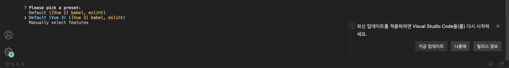
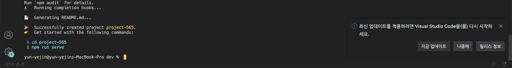
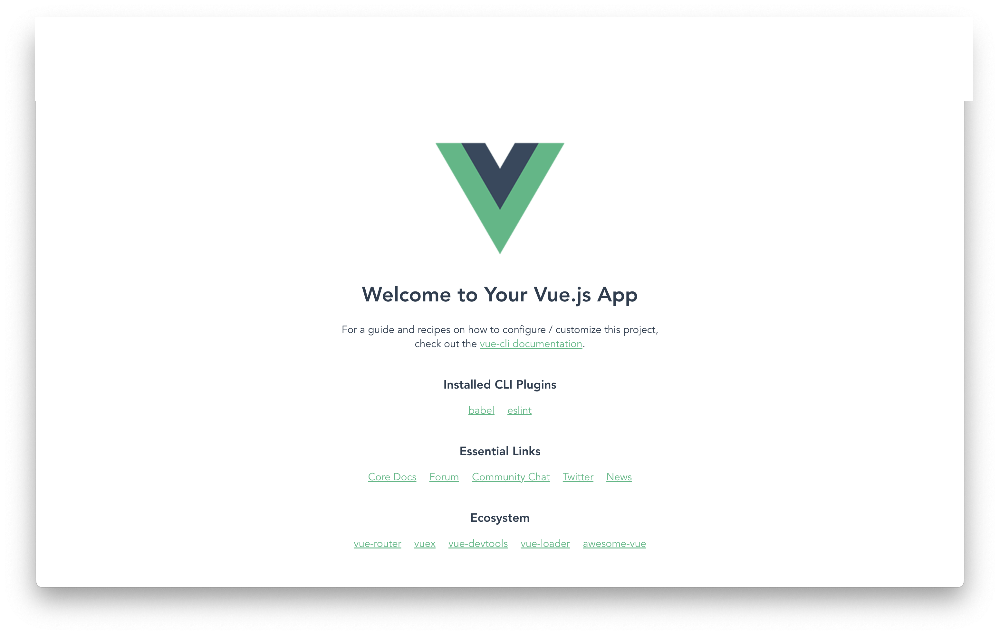

## How to install Vue.js 3.0?

1. **사전 준비**

   Node.js 의 설치.

   Node.js란 서버 사이드 자바스크립트로, 서버 측에서 실행되는 자바스크립트 실행 환경을 의미한다. 프론트엔드 프레임워크인 Vue.js를 위해 Node.js 설치가 선행되어야 하는 이유는 보다 쉬운 vue 프로젝트 구성을 위해서이다.

   <aside>
   💡 CLI : 커맨드 라인 명령어. 가상 터미널 혹은 터미널을 통해 사용자와 컴퓨터가 상호 작용하는 방식을 뜻함. 작업 명령은 사용자가 문자열의 형태로 입력하며, 컴퓨터로부터의 출력 역시 문자열의 형태로 주어진다. (위키백과)

   </aside>

2. **vue 설치**

   `npm install -g @vue/cli`

   vue-cli 는 기본 vue 개발 환경을 설정해주는 도구다. vue-cli 가 기본적인 프로젝트 세팅을 해주기 때문에 폴더 구조에 대한 고민, lint, build, 어떤 라이브러리로 구성을 해야되는지 webpack 설정은 어떻게 해야되는지에 대한 고민을 덜을 수 있다.

   vue-cli 설치 후에는 vue 라는 명령어를 사용할 수 있다.

   `vue create 새로운 프로젝트 명`

   원하는 디렉토리에 위 명령어를 입력하여 새로운 vue 프로젝트를 생성한다.

   

   

   아래 명령어를 다 수행해 주면,

   

   위의 화면이 무사히 나온다.

   📣 VScode 에서 Vetur라는 extension을 설치해주면, 하이라이팅이 적용된 vue 파일을 볼 수 있다 .

참고 :

한 번에 끝내는 프론트엔드 개발 초격차 패키지 Online.

https://velog.io/@song91/Vue3.js-Vue3-시작하기-1-프로젝트-생성-및-환경구성
