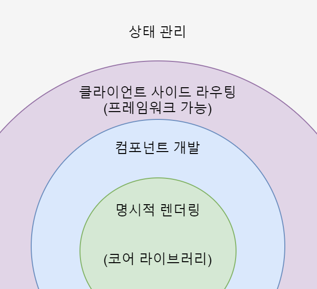
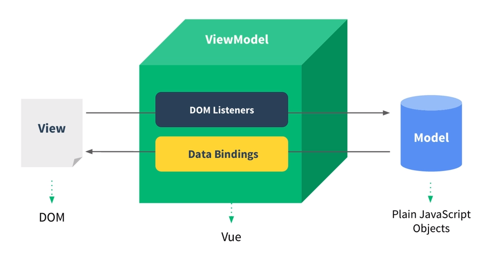
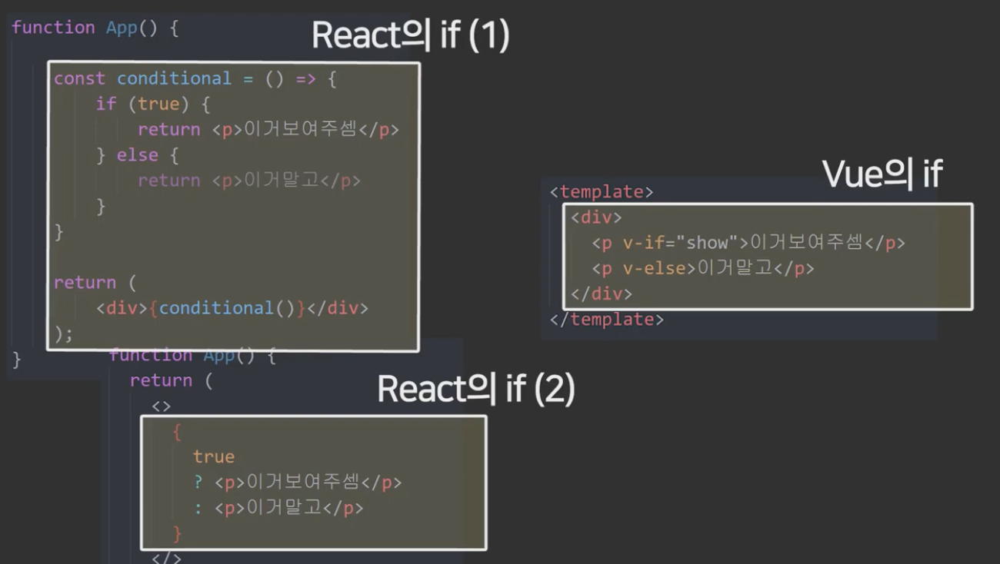

## What is VUE?

vue 프로젝트도 생성했으니, 본격적으로 vue.js 가 무엇인지 알아보자. vue.js 공식 문서에서 말하는 정의는 아래와 같다. 

<aside>
💡 Vue (pronounced /vjuː/, like **view**) is a JavaScript framework for building user interfaces.

Vue는 사용자 인터페이스를 구축하기 위한 JavaScript 프레임워크입니다.

출처: [https://vuejs.org/guide/introduction.html](https://vuejs.org/guide/introduction.html)

</aside>

위 정의를 한번 파악해보자. 

### 사용자 인터페이스를 구축하기 위한

사용자 인터페이스는 흔히 UI(User Interface)라고 칭하기도 한다. 사용자 인터페이스는 사람과 사물 또는 시스템, 기계, 컴퓨터 프로그램 등 사이에서 의사소통을 할 수 있도록 일시적 또는 영구적인 접근을 목적으로 만들어진 물리적, 가상적 매개체를 뜻한다고 한다. 

출처: [https://ko.wikipedia.org/wiki/사용자_인터페이스](https://ko.wikipedia.org/wiki/%EC%82%AC%EC%9A%A9%EC%9E%90_%EC%9D%B8%ED%84%B0%ED%8E%98%EC%9D%B4%EC%8A%A4)

즉, 사람들이 컴퓨터와 상호작용하는 시스템이라는 의미이다. 

위 정의에 적용시켜 이해하자면, vue.js의 **목적은 사용자와 서버 간의 상호작용하는 것을 가능케하는 시스템을 구현하는 것**임을 알 수 있다. 

### JavaScript framework

자바스크립트 프레임워크가 무엇인지 알아보기 전에 먼저 프레임워크부터 살펴보자. 

프레임워크란 **특정 프로그램을 개발하기 위한 여러 요소들과 메뉴얼인 룰을 제공하는 프로그램**이다. 간단히 말해서, 프로그램의 기본 구조( 틀 ) 이라고 할 수 있다. 프레임워크는 개발자가 원하는 기능 구현에만 집중하여 빠른 속도로 개발할 수 있도록 기본적으로 필요한 기능을 갖추고 있다. 기능을 추가하기 위해선 프레임워크가 정의한 규칙에 맞추어 개발해야 한다. 

프레임워크는 크게 3가지의 장점이 있다. 

<aside>
💡 **1. 효율적인 코드작성**

뼈대부터 개발하는 것 대신 프레임워크를 사용하게되면 시간과 비용이 훨씬 절약되어 생산성이 올라가게 된다.

**2. 코드의 질적 향상**

프레임워크에서 제공하는 기능들은 이미 검증된 코드다. 이를 사용하는 것은버그 발생 가능성을 저하시키고, 반복 작업에서 일어날 수 있는 실수들을 방지하게 도와준다.

**3. 안정적인 유지보수**

프레임워크를 사용하게되면 프로젝트 도중 개발 담당자가 바뀌더라도 이미 코드가 비교적 체계적이기 때문에 위험 부담을 줄일 수 있다. 

</aside>

물론 단점도 존재한다. 

<aside>
💡 **1. 학습시간이 길다**

특정 프로그램 언어를 배우고 해당 프레임워크 사용법과 철학을 익혀야 하는 학습이 필요하다. 다수의 개발자가 사용하며 수정의 수정의 거쳐 만들어진 코드들이 대부분이다 보니, 프레임워크에 있는 코드를 습득하고 활용하는 데에 시간이 오래 걸릴 수 있다

**2. 자유롭지 못한 개발 환경**

프레임워크 사용시, 프레임워크의 규칙을 따라야하기 때문에 개발자가 자유롭고 유연하게 개발하는 데에 한계가 있다. 기존의 구조를 유지하며 코드에 적절히 기능을 추가해야하기 때문에 여러 제약 사항이 있을 수 있다. 

</aside>

출처: [https://www.icia.co.kr/community/board/view/2/1/84](https://www.icia.co.kr/community/board/view/2/1/84) , [https://gocoder.tistory.com/1867](https://gocoder.tistory.com/1867)

자, 프레임워크가 무엇인지 알게 되었으니 이제는 자바스크립트 프레임워크가 무엇인지 알아보자. 

활용성이 높아지는 자바스크립트의 구현을 좀더 쉽고 빠르게 하면서 개발 차원에서의 효율성과 사용 차원에서의 편의성을 높이고자 하는 목적을 가진 프레임워크가 자바스크립트 프레임워크이다.

vue.js를 라이브러리라고 말하기도 한다. 그 이유는 vue.js 가 점진적인 프레임워크이기 때문이다. 

Vue 코어 라이브러리는 화면단 데이터 표현에 관한 기능들을 중점적으로 지원한다. 또한 프레임워크의 기능인 라우터, 상태 관리, 테스팅 등을 쉽게 결합할 수 있는 형태로 제공된다. 즉, 라이브러리 역할뿐만 아니라 프레임워크 역할도 할 수 있다는 의미로 Vue를 점진적인 프레임워크라고 표현한다.

출처: [https://velog.io/@rimo09/Vue가-지향하는-Progressive-Framework-컨셉](https://velog.io/@rimo09/Vue%EA%B0%80-%EC%A7%80%ED%96%A5%ED%95%98%EB%8A%94-Progressive-Framework-%EC%BB%A8%EC%85%89)

자바스크립트 프레임워크는 여러가지가 있는데, 나는 그 중에서도 vue.js 를 사용할 예정이다. 

## Vue.js

**MVVM(Model-View-ViewModel) 패턴의 ViewModel 레이어에 해당하는 화면단 라이브러리**

MVVM 패턴이란 백엔드 로직과 클라이언트 의 마크업 & 데이터 표현단을 분리하기 위한 구조이다. 

자바스크립트가 Model의 역할, 돔이 View의 역할을 한다. Vue는 MVVM 패턴의 ViewModel 레이어에 해당하는 화면단 라이브러리이다. 

DOM 변경 시, ViewModel의 DOM Listeners를 거쳐서 Model로 신호가 간다. Model에서 변경된 데이터를 ViewModel을 거쳐서 View로 보냈을 때, 화면이 reactive하게 반응이 일어난다. Vue.js 는 이와 같이 reactive한 프로그래밍이 가능하게 끔 뷰단에서 모든 것을 제어하는 뷰모델 라이브러리이다.

View, Model, ViewModel 이 각각 어떤 역할을 하는지 알아보자.

**View**

사용자에게 보여지는 부분으로 UI와 관련된 것을 다루는 부분이다. 비즈니스 로직은 없고, 뷰 로직만이 존재한다. View는 ViewModel를 지속적으로 관찰한다.

**Model**

프로그램에서 사용되는 데이터가 들어있다. api를 요청하거나, 데이터를 업데이트하는 등의 비즈니스 로직이 있다. 즉, 사용할 데이터에 관련된 동작과 데이터를 다룬다.

**ViewModel**

View와 Model을 연결해주는 역할이다. Model의 데이터가 업데이트되거나 View에서 Model에 있는 함수를 호출할 경우 그로인한 모든 변경 사항들이 자동으로 업데이트 되어 View에 적용된다.

아래는  MVVM 패턴이기에 가질 수 있는 Vue 의 특징을 나열하였다.

- **데이터 바인딩**과 **화면 단위를 컴포넌트 형태로 제공하며, 관련 API 를 지원**하는데에 궁극적인 목적이 있음
   - **데이터 바인딩**

     데이터 바인딩: HTML 태그 안에 Vue 인스턴스에서 속성들을 정의한 data를 연결하여 화면에 표시하는 방법.

- Angular에서 지원하는 **양방향 데이터 바인딩** 을 동일하게 제공
- 하지만 **컴포넌트 간 통신**의 기본 골격은 React의 **단방향 데이터 흐름(부모 -> 자식)**을 사용
- 다른 프런트엔드 프레임워크(Angular, React)와 비교했을 때 상대적으로 **가볍고 빠름**.
- 문법이 단순하고 간결하여 **초기 학습 비용이 낮고 누구나 쉽게 접근 가능**

출처: [https://joshua1988.github.io/web-development/vuejs/vuejs-tutorial-for-beginner/#mvvm-패턴이란](https://joshua1988.github.io/web-development/vuejs/vuejs-tutorial-for-beginner/#mvvm-%ED%8C%A8%ED%84%B4%EC%9D%B4%EB%9E%80)

읽으보면 좋을듯한 vue - mvvm 관계 : [https://blinders.tistory.com/111](https://blinders.tistory.com/111)

## 왜 하필 Vue.js 인가?

이유는 vue.js 의 장점에서 찾아볼 수 있다. 

1. **쉬움** 
    
    가장 대중적인 프론트엔드 프레임워크인 React, Vue의 문법을 예로 한번 살펴보자
    
    
    
    한장의 사진으로도 Vue 가 얼마나 쉽게 기능을 구현하는지 알 수 있다. 문법도 깔끔하게 HTML 스럽게 볼 수 있어서 페이지 구조 파악하기도 쉽다.
    
    간단하지만 다른 라이브러리들과 기능적 차이는 거의 없다. 구현 방법의 차이만 있을 뿐이다. 
    
2. **정해진 코드 작성법**
    
    React에서는 반복문 사용시에도 map, forEach, for, for in, for of등 다양한 문법을 사용할 수 있다. 하지만 Vue서는 v-for라는 문법 하나로 통일된다.
    
    하나로 통일된 문법은 초보자들에게 알맞다. 코드 작성 방법이 하나이기 때문에 코드가 올바른지 아닌지 고민할 필요가 없어진다. 또 협업에도 유리하다. 협업할때  코딩 스타일을 통일하는 것이 필수적인데, vue.js는 이러한 부분이 모두 통일 되어있기에 스타일 통일 작업이 줄어든다.
    
    **세 번째로 쉽고 방법이 하나이기 때문에 초보자들에게 알맞다**말 그대로 코드 작성 방법이 하나라서 이 방법이 맞는건지 고민할 필요가 없어진다.그리고 Vue 문법에 익숙해지면 javascript 문법에 익숙치 않아도 쉽게 코드를 작성 가능하다.반면에 React는 javascript 문법을 필수적으로 알아야한다.
    
3. **빠른 HTML 렌더링이 빠르다**
    
    다른 React와 Angular보다 렌더링 속도가 더 빠르다. 다만, ms 단위라 크게 체감할 정도는 아니라고 한다.
    

1. **꾸준한 업데이트**
    
    꾸준히 업데이트되고 있다. 버전 업데이트도 진행되어 **Vue 3 버전이 기준 버전**이 되었고, 중요한 기능도 추가되고 편의성도 높아졌다.
    
    documentation 또한 매우 잘 되어있다.
    
    출처: [https://codingapple.com/unit/why-use-vue-over-react/](https://codingapple.com/unit/why-use-vue-over-react/)
    

##
